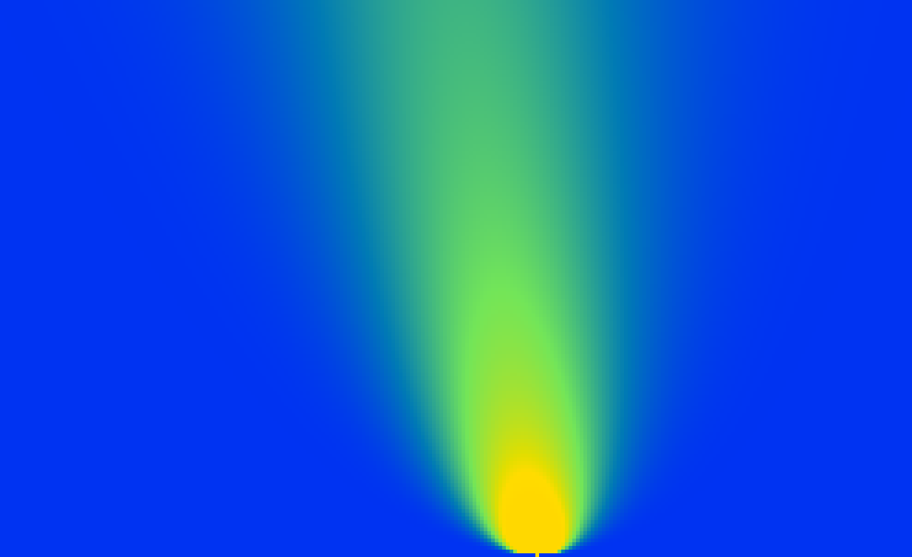

# tile-fd-pricer

[](https://github.com/wazi893/tile-fd-pricer/actions/workflows/ci.yml)
[](LICENSE)

A **deterministic finite-difference option pricer** in Rust.

The numerical core is a three-point **stencil** — every grid value is computed
from its immediate neighbours:

```
V'ᵢ = pd·Vᵢ₋₁ + pm·Vᵢ + pu·Vᵢ₊₁
```

That is the same `output = f(left, center, right)` access pattern as the
cellular-automaton engine this technique is borrowed from (a register-resident
stencil kernel running at ~10¹⁴ cells/s on GPU). The PDE solver reuses the
*architecture* — neighbour-local updates, deterministic ordering, cache-friendly
sweeps — with a floating-point kernel in place of the boolean one.

| Gamma surface `Γ(S,τ)` (1D) | Heston implied-vol skew |
|---|---|
|  |  |

*Left: Gamma read straight off the grid — a ridge at the strike that explodes
toward expiry. Right: the Heston model's negative implied-vol skew (high vol at
low strikes), which constant-vol Black–Scholes cannot produce.*

See [`WRITEUP.md`](WRITEUP.md) for the full story.

## Why finite differences (and not Monte Carlo)

| | Monte Carlo | Finite differences |
|---|---|---|
| American / early exercise | needs Longstaff–Schwartz regression | one `max(V, payoff)` per step |
| Greeks (Δ, Γ) | bump-and-revalue, noisy | read directly off the grid |
| Barrier / knock-out | discrete-monitoring bias | exact `V = 0` boundary |
| Convergence | stochastic, O(1/√N) | deterministic, O(Δx²) |
| Reproducibility | seed-dependent | **bit-identical** |

## Correctness

European options have a closed-form Black–Scholes price, used as the oracle.
The headline test is the **convergence order**: as the grid is refined the
Crank–Nicolson error falls quadratically, the signature of a correct
second-order scheme.

```
ATM put, S=K=100, r=5%, σ=20%, T=1y     price       delta       gamma
Black–Scholes (exact)                  5.573518   -0.363169    0.018762
FD European (800×800, Crank–Nicolson)  5.573132   -0.363169    0.018763   (err 3.9e-4)
FD American                            6.089204     — early-exercise premium 0.516
```

The suite also verifies put–call parity on the grid, that the American call on a
non-dividend stock equals its European twin (a known no-arbitrage result), and
that pricing is **bit-for-bit deterministic** across runs.

## Run it

```bash
cargo test --release             # validation suite (convergence, parity, determinism)
cargo run --release --example price
cargo run --release --example surface   # writes interactive option_surface.html
```

## Visualisation

`cargo run --release --example surface` emits a self-contained
`option_surface.html` (no dependencies, opens in any browser): the option value
surface `V(S, τ)` animating backward from expiry to today, the FD European and
American prices tracking the exact Black–Scholes curve, live Delta/Gamma, and a
toggle for the American early-exercise free boundary.

## Performance — a benchmark that corrected itself

A single option is microseconds of work; a desk prices a *book* of thousands. So
the stencil is vectorised **across options** (four contracts per AVX2 `f64`
register, marching in lockstep), then the book is split across threads with
`std::thread::scope`. Every path is verified **bit-identical** to a scalar
reference (same fused-multiply-add order) before timing.

My first run looked great — ~16× from SIMD, ~170× with threads. It was wrong, and
chasing down why is the interesting part:

> `f64::mul_add` lowers to a **libm `fma()` call** unless the target has FMA
> enabled at compile time. The scalar baselines were paying a function call per
> operation while the AVX2 kernel used a hardware `vfmadd` — so the "SIMD"
> speedup was mostly a missing `-C target-feature=+fma`.

With native codegen (`.cargo/config.toml`), the honest picture (best-of-3,
8192 options, 256×488 grid, 32-core box):

```
                          time        throughput        stencil    vs prev
scalar (naive, AoS)     0.122 s     66 968 opt/s      8.3 Gupd/s     1.00×
scalar (SoA layout)     0.216 s     37 915 opt/s      4.7 Gupd/s     0.57×
AVX2 (4×f64, SoA)       0.106 s     77 594 opt/s      9.7 Gupd/s     2.05×
AVX2 + 32 threads       0.009 s    937 246 opt/s    116.6 Gupd/s    12.1×
```

What it actually shows:

- The compiler **auto-vectorises the naive contiguous loop** — my hand-written
  AVX2 is only ~1.16× faster than letting the optimiser do it.
- My structure-of-arrays-*across-options* layout **hurt** the scalar path (0.57×):
  the stride-4 access defeats unit-stride auto-vectorisation.
- The durable win is **threading (~12× on 32 cores)**, not the intrinsics.

Takeaways: know what your "scalar" code compiles to (`mul_add` without `+fma` is
a call); the compiler is often as good as hand-written SIMD once it can see the
target; measure before vectorising by hand. Reproduce with
`cargo run --release --example bench [count]`.

## Heston stochastic volatility (2D)

Under Heston the variance is itself stochastic, so the option value `U(S, v, τ)`
solves a 2D PDE with a correlation cross term. Discretised in `(ln S, v)`, each
step is a **nine-point stencil** — five axis neighbours plus four diagonal
corners — the same `f(neighbours)` pattern, now in two dimensions.

Heston has no closed form, so `heston::analytic_price` implements the
characteristic-function (Fourier) integral as an oracle. Two solvers are
validated against it (and against each other, and the Black–Scholes ξ → 0
limit):

- `heston::solve` — the explicit nine-point stencil; simple, but the time step
  is stability-bound by the vol-of-vol diffusion (~20k steps).
- `heston::solve_adi` — a **Douglas ADI** scheme (explicit cross term, implicit
  tridiagonal corrections along each axis). **Unconditionally stable**, so it
  prices in ~200 steps with the same accuracy. Matches the Fourier oracle to
  <2% across correlations, vol-of-vols, maturities, and moneyness.

The signature result is the **implied-volatility skew** that flat Black–Scholes
cannot produce:

```
cargo run --release --example heston_surface   # writes heston_surface.html
```

The visualisation shows the IV surface (strike × maturity), smile
cross-sections, and the FD value surface `U(S, v)`.

## Status / roadmap

- **Phase 1 (done)** — 1D Black–Scholes grid, explicit + Crank–Nicolson schemes,
  European + American, Greeks, closed-form validation.
- **Phase 2 (done)** — SoA batched pricer: scalar → AVX2 → AVX2 + threads,
  bit-identical parity, throughput ladder.
- **Phase 3 (done)** — interactive HTML value-surface + Δ/Γ visualisation.
- **Phase 4 (done)** — 2D Heston stochastic vol: explicit + Douglas ADI schemes,
  Fourier oracle, implied-vol surface visualisation.
- Next — CUDA port of the stencil; American options under ADI via PSOR;
  Craig–Sneyd second-order cross-term correction.

## License

MIT
